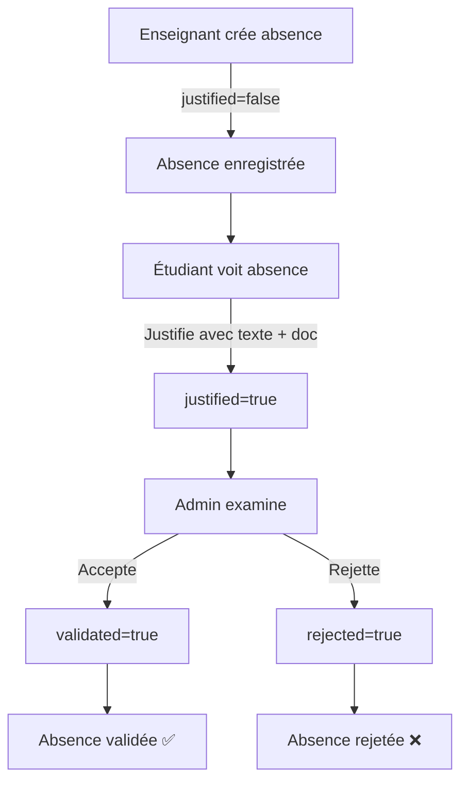

# 🎓 Timetable Manager - Système de Gestion des Absences Scolaires

Un système complet de gestion des absences pour établissements scolaires, développé avec Spring Boot et une interface moderne.


---

## 📋 Table des Matières

- [Vue d'ensemble](#vue-densemble)
- [Fonctionnalités](#fonctionnalités)
- [Architecture](#architecture)
- [Prérequis](#prérequis)
- [Installation](#installation)
- [Configuration](#configuration)
- [Utilisation](#utilisation)
- [Comptes de Démonstration](#comptes-de-démonstration)
- [Structure du Projet](#structure-du-projet)
- [Technologies Utilisées](#technologies-utilisées)
- [Workflows](#workflows)
- [Captures d'écran](#captures-décran)

---

## 🎯 Vue d'ensemble

**Timetable Manager** est une application web permettant de gérer efficacement les absences scolaires avec un système de rôles et de validation en trois étapes :

1. **Professeurs** enregistrent les absences
2. **Étudiants** justifient leurs absences (texte + document optionnel)
3. **Administrateurs** valident ou rejettent les justifications

### Cas d'usage

- Enregistrement rapide des absences par les enseignants
- Justification en ligne par les étudiants avec pièces jointes
- Validation centralisée par l'administration
- Suivi en temps réel de l'assiduité

---

## ✨ Fonctionnalités

### 👨‍🎓 Pour les Étudiants

- ✅ Consultation de leurs propres absences
- ✍️ Justification avec texte explicatif (obligatoire)
- 📄 Upload de documents justificatifs (certificat médical, etc.) - optionnel
- 🔒 Accès sécurisé uniquement à leurs données personnelles

### 👨‍🏫 Pour les Enseignants

- ➕ Création d'absences pour les étudiants
- 📚 Sélection du cours et de la date
- 👥 Liste complète des étudiants
- 📊 Tableau de bord dédié

### ⚙️ Pour les Administrateurs

- 👁️ Visualisation de toutes les absences
- 📋 Lecture des justifications et documents
- ✅ Validation des absences justifiées
- ❌ Rejet des justifications non valables
- 📥 Téléchargement des pièces justificatives

### 🎨 Interface Utilisateur

- 🎨 Design professionnel aux couleurs scolaires (bleu marine, doré)
- 📱 Interface responsive (mobile-friendly)
- 🃏 Cartes modernes et tableaux stylisés
- 🏷️ Badges colorés pour les statuts
- ✨ Animations fluides

---

## 🏗️ Architecture

### Modèle de Données

```
User (1:1) ←→ Student
User (1:1) ←→ Teacher
Teacher (1:N) → Course
Course (N:M) ← Student
Student (1:N) → Absence
Course (1:N) → Absence
```

### Entités Principales

**User**
- Authentification et rôles (ADMIN, TEACHER, STUDENT)
- Mot de passe BCrypt

**Absence**
- Date, statuts (justified, validated, rejected)
- Texte de justification
- Chemin du document uploadé
- Raison de rejet (si applicable)

**Course**
- Nom de la matière
- Enseignant responsable

---

## 📦 Prérequis

- **Java 17** ou supérieur
- **Maven 3.6+**
- **MySQL 8.0+**
- **Port 8080** disponible

---

## 🚀 Installation

### 1. Cloner le Projet

```bash
cd /Users/mac/timetable-manager
```

### 2. Créer la Base de Données

```bash
mysql -u root -p
```

```sql
CREATE DATABASE timetable_db CHARACTER SET utf8mb4 COLLATE utf8mb4_unicode_ci;
EXIT;
```

### 3. Configurer les Identifiants MySQL

Éditer `src/main/resources/application.properties` :

```properties
spring.datasource.url=jdbc:mysql://localhost:3306/timetable_db
spring.datasource.username=root
spring.datasource.password=VOTRE_MOT_DE_PASSE
```

### 4. Créer le Dossier d'Upload

```bash
mkdir -p uploads
```

### 5. Compiler et Lancer

```bash
./mvnw clean install
./mvnw spring-boot:run
```

L'application sera accessible sur **http://localhost:8080**

---

## ⚙️ Configuration

### application.properties

| Propriété | Description | Valeur par défaut |
|-----------|-------------|-------------------|
| `spring.datasource.url` | URL de la base de données | `jdbc:mysql://localhost:3306/timetable_db` |
| `spring.jpa.hibernate.ddl-auto` | Gestion du schéma | `update` |
| `spring.servlet.multipart.max-file-size` | Taille max fichier | `5MB` |
| `spring.servlet.multipart.max-request-size` | Taille max requête | `5MB` |

### Données Initiales

Au premier démarrage, le système crée automatiquement :

- **3 rôles** : ADMIN, TEACHER, STUDENT
- **1 admin** : admin1
- **2 enseignants** : teacher1, teacher2
- **6 étudiants** : student1 à student6
- **5 cours** : Mathématiques, Physique, Chimie, Histoire, Français

**Mot de passe par défaut pour tous** : voir section [Comptes de Démonstration](#comptes-de-démonstration)

---

## 💻 Utilisation

### Accès à l'Application

1. Ouvrir un navigateur
2. Aller sur `http://localhost:8080`
3. Se connecter avec l'un des comptes de démonstration

### Workflow Complet

#### 📝 Scénario : Gérer une Absence

**Étape 1 : Enseignant enregistre l'absence**

```
1. Login: teacher1 / teacher123
2. Cliquer sur "Mark Absence"
3. Sélectionner un étudiant (ex: Sophie Leroy)
4. Sélectionner un cours (ex: Mathématiques)
5. Choisir la date
6. Enregistrer
```

**Étape 2 : Étudiant justifie**

```
1. Logout puis login: student2 / student123
2. Voir l'absence non justifiée
3. Cliquer sur "Justify"
4. Entrer une explication (ex: "J'étais malade avec la grippe")
5. (Optionnel) Uploader un certificat médical PDF
6. Soumettre
```

**Étape 3 : Admin valide ou rejette**

```
1. Logout puis login: admin1 / admin123
2. Aller sur "Validate Absences"
3. Cliquer sur "View Details" pour l'absence de Sophie
4. Lire la justification
5. Télécharger le document (si fourni)
6. Décision:
   - Cliquer "✅ Validate" si justification acceptable
   - Cliquer "❌ Reject" si justification insuffisante
```

---

## 🔑 Comptes de Démonstration

### Administrateur

| Username | Password | Accès |
|----------|----------|-------|
| `admin1` | `admin123` | `/admin` - Validation des absences |

### Enseignants

| Username | Password | Nom | Matières |
|----------|----------|-----|----------|
| `teacher1` | `teacher123` | Marie Dupont | Mathématiques, Physique, Français |
| `teacher2` | `teacher123` | Pierre Martin | Chimie, Histoire |

### Étudiants

| Username | Password | Nom Complet |
|----------|----------|-------------|
| `student1` | `student123` | Jean Dubois |
| `student2` | `student123` | Sophie Leroy |
| `student3` | `student123` | Thomas Bernard |
| `student4` | `student123` | Emma Petit |
| `student5` | `student123` | Lucas Robert |
| `student6` | `student123` | Léa Moreau |

---

## 📁 Structure du Projet

```
timetable-manager/
├── src/
│   ├── main/
│   │   ├── java/com/school/timetable/
│   │   │   ├── config/                 # Configuration Spring
│   │   │   │   ├── DataInitializer.java      # Données initiales
│   │   │   │   └── SecurityConfig.java       # Sécurité Spring
│   │   │   ├── controller/             # Contrôleurs MVC
│   │   │   │   ├── AdminAbsenceController.java
│   │   │   │   ├── AbsenceController.java    # Teacher
│   │   │   │   ├── StudentController.java
│   │   │   │   ├── DashboardController.java
│   │   │   │   └── RedirectController.java
│   │   │   ├── entity/                 # Entités JPA
│   │   │   │   ├── User.java
│   │   │   │   ├── Role.java
│   │   │   │   ├── Student.java
│   │   │   │   ├── Teacher.java
│   │   │   │   ├── Course.java
│   │   │   │   └── Absence.java
│   │   │   ├── repository/             # Repositories JPA
│   │   │   │   ├── UserRepository.java
│   │   │   │   ├── RoleRepository.java
│   │   │   │   ├── StudentRepository.java
│   │   │   │   ├── TeacherRepository.java
│   │   │   │   ├── CourseRepository.java
│   │   │   │   └── AbsenceRepository.java
│   │   │   ├── security/
│   │   │   │   └── service/
│   │   │   │       └── CustomUserDetailsService.java
│   │   │   └── TimetableManagerApplication.java
│   │   └── resources/
│   │       ├── static/css/
│   │       │   └── style.css           # Styles personnalisés
│   │       ├── templates/              # Vues Thymeleaf
│   │       │   ├── login.html
│   │       │   ├── admin.html
│   │       │   ├── admin-absences.html
│   │       │   ├── absence-details.html
│   │       │   ├── teacher.html
│   │       │   ├── absence-form.html
│   │       │   ├── student.html
│   │       │   └── justify-absence.html
│   │       └── application.properties  # Configuration
├── uploads/                            # Documents uploadés
├── pom.xml                            # Dépendances Maven
└── README.md                          # Ce fichier
```

---

## 🛠️ Technologies Utilisées

### Backend

- **Spring Boot 3.5.9** - Framework principal
- **Spring Security** - Authentification et autorisation
- **Spring Data JPA** - Persistence des données
- **Hibernate 6.x** - ORM
- **MySQL 8** - Base de données
- **BCrypt** - Hashing des mots de passe

### Frontend

- **Thymeleaf** - Moteur de template
- **Vanilla CSS** - Styles personnalisés
- **HTML5** - Structure

### Sécurité

- ✅ BCrypt pour les mots de passe
- ✅ CSRF protection activée
- ✅ Role-based access control (RBAC)
- ✅ Session management
- ✅ File upload validation

---

## 🔄 Workflows

### Cycle de Vie d'une Absence



### Authentification et Redirection

```mermaid
graph LR
    A[Login] --> B{Rôle?}
    B -->|ADMIN| C[/admin]
    B -->|TEACHER| D[/teacher]
    B -->|STUDENT| E[/student]
```

---

## 📸 Captures d'écran

### Page de Connexion


### Dashboard Administrateur


### Dashboard Enseignant


### Dashboard Étudiant


---

## 🐛 Résolution de Problèmes

### Erreur de Connexion MySQL

```
Error: Access denied for user 'root'@'localhost'
```

**Solution** : Vérifier les identifiants dans `application.properties`

### Port 8080 Déjà Utilisé

```bash
# Trouver et tuer le processus
lsof -i :8080
kill -9 <PID>
```

### Erreur Upload de Fichier

```
FileUploadException: The field document exceeds its maximum permitted size
```

**Solution** : Le fichier dépasse 5MB. Réduire la taille ou modifier `spring.servlet.multipart.max-file-size`

---

## 🔐 Sécurité

### Bonnes Pratiques Implémentées

1. **Mots de passe** : Tous hashés avec BCrypt
2. **CSRF Protection** : Activée par défaut
3. **Upload de fichiers** :
   - Noms de fichiers UUID (pas de path traversal)
   - Types autorisés : PDF, JPG, PNG
   - Taille max : 5MB
4. **Autorisation** :
   - Étudiants voient uniquement leurs absences
   - Séparation stricte des rôles

### Recommandations Production

- ⚠️ Changer tous les mots de passe par défaut
- ⚠️ Utiliser HTTPS
- ⚠️ Configurer des backups MySQL réguliers
- ⚠️ Limiter les tentatives de connexion
- ⚠️ Logger les actions sensibles

---

## 📝 Licence

Ce projet est sous licence MIT. Voir le fichier `LICENSE` pour plus de détails.

---

## 👥 Contribution

Les contributions sont les bienvenues ! Pour contribuer :

1. Fork le projet
2. Créer une branche feature (`git checkout -b feature/AmazingFeature`)
3. Commit les changements (`git commit -m 'Add AmazingFeature'`)
4. Push vers la branche (`git push origin feature/AmazingFeature`)
5. Ouvrir une Pull Request

---

## 📧 Support

Pour toute question ou problème :

- 📧 Email : support@timetable-manager.com
- 🐛 Issues : [GitHub Issues](https://github.com/votre-repo/timetable-manager/issues)

---

## 🙏 Remerciements

- Spring Team pour l'excellent framework
- MySQL pour la base de données robuste
- Thymeleaf pour le templating élégant

---

**Développé avec ❤️ pour l'éducation** 🎓

---

## 📚 Documentation Complémentaire

- [Spring Boot Documentation](https://spring.io/projects/spring-boot)
- [Spring Security Reference](https://docs.spring.io/spring-security/reference/)
- [Thymeleaf Documentation](https://www.thymeleaf.org/documentation.html)
- [MySQL Documentation](https://dev.mysql.com/doc/)

---

**Version** : 1.0.0  
**Dernière mise à jour** : Janvier 2026
